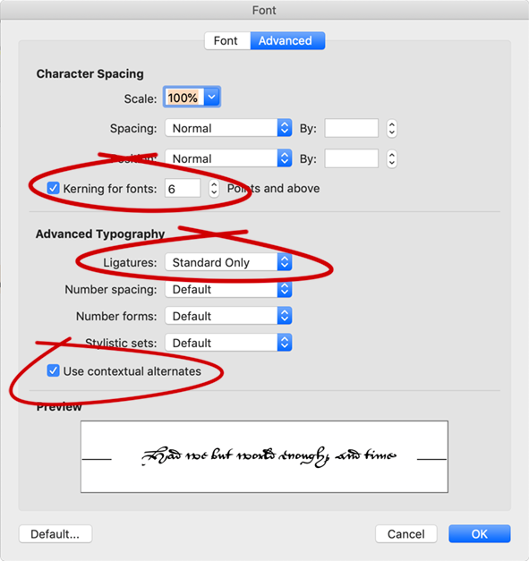

The Joscelyn font is named for John Joscelyn (1529-1604), secretary to Matthew Parker, Archbishop of Canterbury from 1559 to 1575. Among the first Englishmen to recover the ability to read the Old English language, Joscelyn compiled an Old English dictionary, contributed to Parker's published works, and wrote _Historiola Collegii Corporis Christi_, a short history of Corpus Christi College, Cambridge, Parker's college.

This font is based on the elegant hand of a scribe who produced the copy of Joscelyn's _Historiola_ in MS Corpus Christi College, Cambridge, 488. It is, as far as I know, the only attempt to produce an accurate and uncompromising reproduction of the notoriously difficult Renaissance secretary hand in a digital font, using OpenType features to represent the cursive and highly variable character of the hand.

To use this font, you must make sure that two OpenType features are turned on in your software: Contextual Alternates (calt) and Standard Ligatures (liga). These are on by default in all major software except Microsoft Word, where you must turn them on explicitly (preferably by editing a style) on the “Advanced” tab of the “Font” dialog:

It is important that the “kerning” box be checked (though kerning is not strictly necessary), since checking this box enables all other OpenType features.

Typing in Joscelyn can be an interesting experience! See [this YouTube clip](https://youtu.be/6fnNWjpEEUc).
